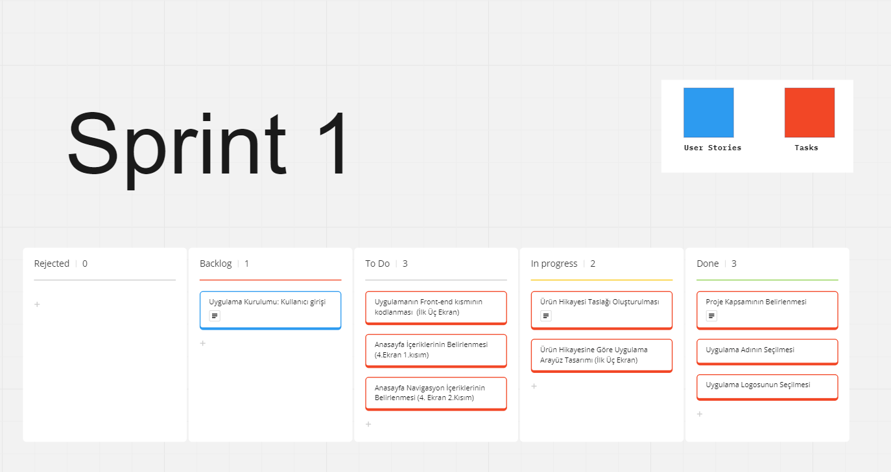
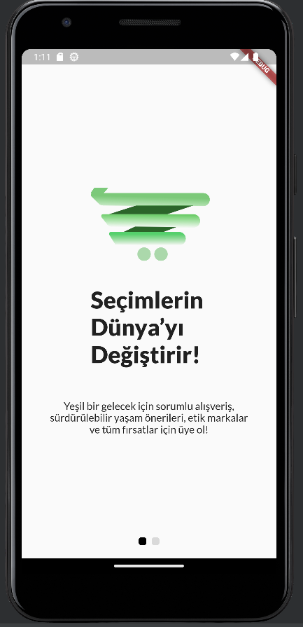
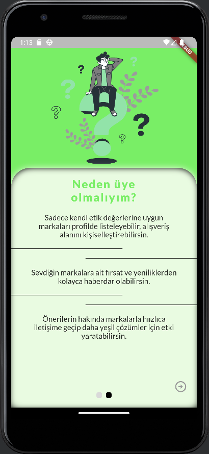
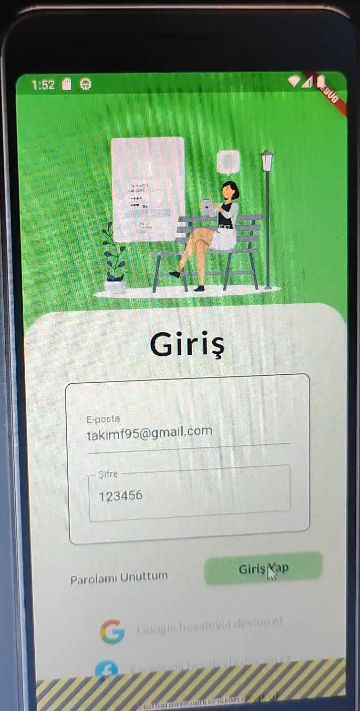
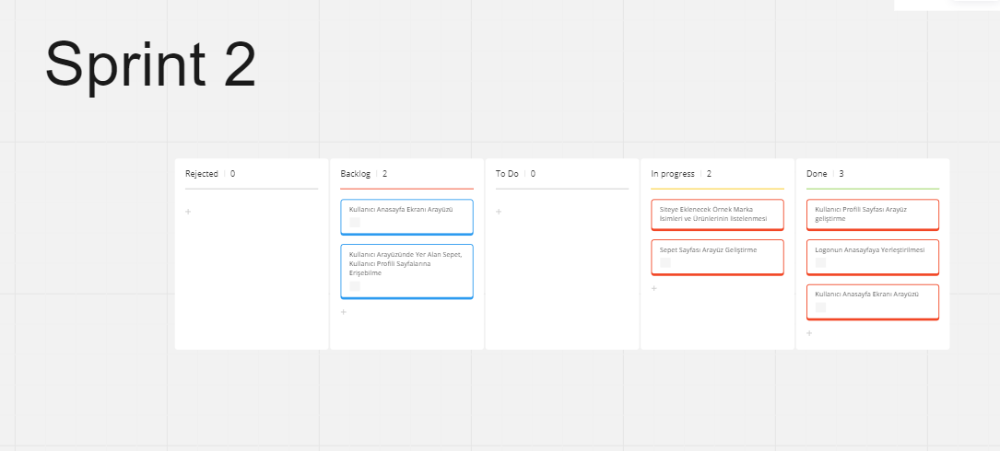
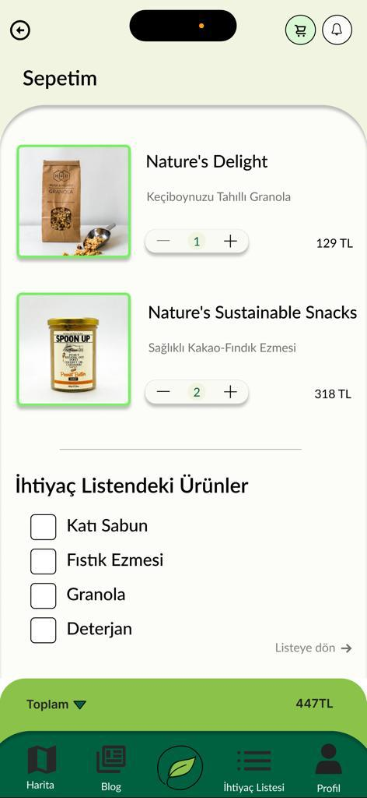

# Takım İsmi
Takım Flutter 95

# Ürün İle İlgili Bilgiler
## Takım Elemanları
- Neslihan Uzun: **Product Owner**
- Şeyma Kumit: **Scrum Master**
- Kaan Binen: **Developer**
- Ömer Kozuva: **Developer**
- Esra Bilgiç: **UX/UI Designer**

## Ürün İsmi
--ECOMARKT--

## Ürün Açıklaması
Bu proje, çevre dostu ürünlere erişimi kolaylaştırmak ve sürdürülebilir bir yaşam tarzını teşvik etmek amacıyla bir marketplace uygulaması geliştirilmesini hedeflemektedir. Pazaryeri, kullanıcıların çevre dostu ürünleri keşfetmelerine, satın almalarına ve satmalarına olanak sağlayacak bir platform olacaktır.
## Ürün Özellikleri
1. Ürün kategorileri: Marketplace'de çevre dostu ürünlerin farklı kategorileri (giyim, gıda, kişisel bakım, ev ve temizlik) bulunacaktır.
2. Ürün arama ve filtreleme: Kullanıcılar, ürünleri aramak ve filtrelemek için kategori, marka, fiyat aralığı, sertifikasyonlar vb. gibi özellikleri kullanabilecektir.
3. Ürün detayları ve değerlendirmeler: Her ürün için ayrıntılı açıklamalar, özellikler, fotoğraflar ve kullanıcı değerlendirmeleri sunulacaktır.
4. Kullanıcı profilleri: Kullanıcılar, hesap oluşturarak favori ürünleri kaydedebilecek, satıcıları takip edebilecek ve değerlendirmeler yapabilecektir.
5. Sürdürülebilirlik bilgileri: Kullanıcılara, ürünlerin çevresel etkileri hakkında bilgi verilecek ve sürdürülebilirlikle ilgili ipuçları sunulacaktır.

## Hedef Kitle
- Çevreye duyarlı tüketiciler: Sürdürülebilir bir yaşam tarzını benimseyen ve çevre dostu ürünlere ilgi duyan kişiler
- Çevre dostu ürünler satan işletmeler: Sürdürülebilir üreticiler, el emeği ürünler, organik ürünler gibi çevre dostu ürünleri üreten veya satan işletmeler
- Daha az atıkla yaşamayı hedefleyen bireyler
- Sürdürülebilirlik temasıyla bilinçli alışveriş yapanlar
- İklim değişikliği konusunda adım atmak isteyenler
- Karbon ayak izi konusunda hassasiyet gösteren tüketiciler

## Product Backlog URL
-----
 [Product Backlog Flutter Team 95](https://miro.com/app/board/uXjVM93Y9Ew=/?share_link_id=757237939795)
# Sprint 1
-**Sprint içinde tamamlanması tahmin edilen puan:** 100 Puan

-**Puan tamamlama mantığı:** Toplamda proje boyunca tamamlanması gereken 480 puanlık backlog bulunmaktadır. 3 sprint'e bölündüğünde ilk sprint'in en azından 150 ile başlaması gerektiği değerlendirildi ancak ekip üyelerinin müsaitlik durumuna uygun olmayacağı tespit edilerek bu sprintte 100 puan tamamlanmasına karar verildi.

-**Daily Scrum:** Daily Scrum toplantılarının zamansal sebeplerden Whatsapp üzerinden yapılmasına karar verilmiştir. Daily Scrum toplantısı örnekleri word olarak Readme'de tarafımızdan paylaşılmaktadır: [Sprint 1 Daily Scrum Chats](https://drive.google.com/file/d/1uymS2xLsTaUjEsf27hTTZ3c4Nyx2XJrI/view?usp=sharing)

-**Sprint board update:** Sprint board screenshotları:
 

- **Sprint Notları**
- Ürün kabul kriterleri ve açıklamaları taskların içerisinde görüntülenebilmektedir.
- **Ürün Durumu**: Ekran Görüntüleri

   \
   \
  

-**Sprint Review:** Alınan kararlar: Kullanıcıyı karşılayacak ilk iki ekran ve giriş&kayıt ekranı tasarlanmış, frontend kısmı kodlanmış, anasayfa tasarımı ve içerikleri taslak olarak hazırlanmış, eksiklikler değerlendirilmiştir. Sprint Review katılımcıları: Neslihan Uzun, Şeyma Kumit, Kaan Binen, Esra Çiftçi, Ömer Kozuva

-**Sprint Retrospective:**
- Asana platformunda atanan görevlerin daha dikkatli takip edilmesi gerektiğine,
- Projeye ayrılan zamanın ilerleyen sprintlerde daha fazla olmasının gerekliliğine,
- Ekip içi iletişimin arttırılmasına vurgu yapılmıştır.

# **Product Backlog URL**
[**Product Backlog Flutter Team 95**](https://miro.com/app/board/uXjVM91Zno8=/?share_link_id=494123797558)

# Sprint 2
-**Sprint içinde tamamlanması tahmin edilen puan:** 150 puan

-**Puan tamamlama mantığı:** Toplamda proje boyunca tamamlanması gereken 480 puanlık backlog bulunmaktadır. Bu Sprintte 150 puanlık backlog tamamlanması kararlaştırılmıştır.

-**Daily Scrum:** Daily Scrum toplantılarının zamansal sebeplerden ötürü Whatsapp üzerinden yapılmasına karar verilmiştir. Daily Scrum toplantısı örneği jpeg veya word olarak Readme'de tarafımızdan paylaşılmaktadır: [Sprint 2 Daily Scrum Chats](https://drive.google.com/file/d/148d1ErFW39tqM1NzZGgN3IyX7qm8YXHd/view?usp=sharing)

-**Sprint board update:** Sprint board screenshotları:

- **Sprint Notları**
- Ürün kabul kriterleri ve açıklamaları taskların içerisinde görüntülenebilmektedir.
- **Ürün Durumu**: Ekran Görüntüleri
- *Kullanıcı Anasayfası* \
  \
- *Kullanıcı Profili* \
  \
- *Sepet* \
 
 
-**Sprint Review:** Alınan kararlar: Bir Önceki Sprintte karşılaşılan problem giderilmeye çalışılmış, Kullanıcı anasayfa ekranı, sepet ekranı, kullanıcı profili ekranları tasarlanmış, ürünlerin yer alacağı sayfa içeriği hazırlanmış yer alacak marka ve ürünlerin listesi yapılmıştır ve eksiklikler değerlendirilmiştir.
-*Sprint Review katılımcıları: Neslihan Uzun, Şeyma Kumit, Kaan Binen, Esra Çiftçi, Ömer Kozuva*

-**Sprint Retrospective:**
- 2.Sprintten daha fazla verim alabilmenin mümnkün olduğuna ancak yeterli zamanın ayırılmadığına değinilmiş olup, geri kalan sprintte her iki sprintten daha yoğun bir program izlenmesi gerektiğine vurgu yapılmıştır.
- Karşılaşılan sorunlar ile ilgili en hızlı çözüme ulaşmak için tüm ekibin birlikte çalışması gerektiği ve Daily Scrumlara tüm ekip üyelerinin aktif katılımının önemi üzerinde durulmuştur.
- Görev takibi ve projenin ilerleyişindeki kısmi yavaşlama konusunda çözüm önerileri değerlendirilmiştir.

# **Product Backlog URL**
[**Product Backlog Flutter Team 95**](https://miro.com/welcomeonboard/WFRwTmpLbzU0Tmt6VGdiZk5PcTFhM2cwZHVPRzJJbTRLZlU2UFNuUmpJaWdVb1djQkJ2SmN0M0l3aW9POUcxcHwzMDc0NDU3MzU3NTExMzM1NDk0fDI=?share_link_id=251862118617)

# Sprint 3
-**Sprint içinde tamamlanması tahmin edilen puan:** 
-**Puan tamamlama mantığı:**
-**Daily Scrum:** Daily Scrum toplantılarının zamansal sebeplerden ötürü Whatsapp üzerinden yapılmasına karar verilmiştir. Daily Scrum toplantısı örneği jpeg veya word olarak Readme'de tarafımızdan paylaşılmaktadır: 
-**Sprint board update:**
- **Sprint Notları**
- Ürün kabul kriterleri ve açıklamaları taskların içerisinde görüntülenebilmektedir.
- **Ürün Durumu**: Ekran Görüntüleri
